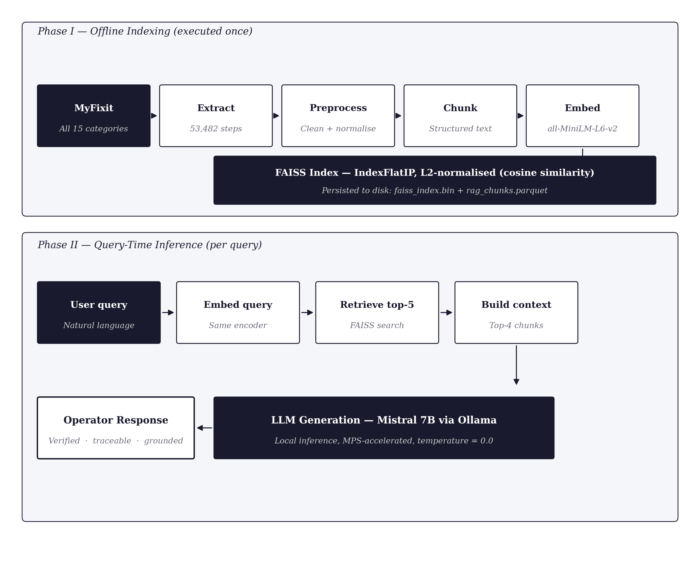

# RAG-Enhanced LLM Support System for Repair and Disassembly Guidance

A Retrieval-Augmented Generation (RAG) pipeline built on the **MyFixit dataset** that
grounds large-language-model responses in step-level repair knowledge. Built to
support human operators in repair and disassembly tasks within the broader
**Circular Data Framework**.

> Human in Command Research Project — Hochschule Aalen, Germany
> M.Sc. Machine Learning and Data Analytics
> Author: **Asim Nayakawadi** · Supervisor: **Prof. Oday Al-Hyali**

---

## What it does

General-purpose LLMs aren't reliable for repair tasks — they hallucinate steps,
invent tools, and can't cite a source. This project fixes that by retrieving the
relevant step-level instructions from the MyFixit corpus first, then handing them
to a local LLM (Mistral via Ollama) with a strict prompt that limits the model to
the retrieved context.

The whole thing runs on a laptop — no API keys, no cloud bills.

---

## Key results

| Metric                         | Score      |
| ------------------------------ | ---------- |
| Average Precision@3            | **0.87**   |
| Grounding Rate                 | **0.80**   |
| Hallucination Rate             | **0.00**   |
| Indexed chunks (full corpus)   | **53,482** |
| Test queries                   | 7 across 5 device categories |

---

## Architecture



**Phase I — Offline indexing (run once):**
load 15 MyFixit JSON files → flatten into step-level rows → preprocess →
build a structured `chunk_text` per step → deduplicate → embed with
`all-MiniLM-L6-v2` → build a FAISS `IndexFlatIP` (cosine via L2-normalised
inner product) → persist to disk.

**Phase II — Query-time inference (per query):**
embed the query with the same encoder → retrieve top-K chunks → optionally
filter by device category → build a context block → generate with Mistral 7B
via Ollama, with a strict prompt that confines the answer to the context.

---

## Tech stack

| Component        | Choice                                        | Why |
| ---------------- | --------------------------------------------- | --- |
| Embedding model  | `sentence-transformers/all-MiniLM-L6-v2`      | 384-dim, fast, semantic-similarity trained |
| Vector index     | FAISS `IndexFlatIP` + L2 normalisation        | Exact cosine search, fine for ~50k chunks |
| LLM generator    | Mistral 7B via Ollama                         | Local, free, MPS-accelerated, instruction-tuned |
| Compute          | MPS (Apple Silicon) → CUDA → CPU fallback     | Runs on consumer hardware |
| Persistence      | `faiss_index.bin` + `rag_chunks.parquet`      | Skip re-embedding on subsequent runs |
| UI               | Streamlit (`app.py`)                          | Chat interface with device filtering |

---

## Quickstart

### Prerequisites

- Python 3.9+
- [Ollama](https://ollama.com) installed and running
- Mistral 7B pulled: `ollama pull mistral`

### Setup

```bash
git clone https://github.com/AsimNayakawadi/myfixit-rag.git
cd myfixit-rag

python3 -m venv .venv
source .venv/bin/activate          # macOS / Linux
pip install -r requirements.txt
```

### Build the index (one-time, ~3–4 min on MPS)

```bash
jupyter notebook rag_pipeline.ipynb
```

Run all cells. The MyFixit dataset is cloned automatically on the first run.
On subsequent runs the notebook detects the saved `faiss_index.bin` and
`rag_chunks.parquet` and skips the slow encoding step.

### Launch the Streamlit app

```bash
ollama serve                       # in a separate terminal
streamlit run app.py
```

Opens at http://localhost:8501. Pick a device category, ask a repair question,
get a grounded answer with source citations.

---

## Project layout

```
myfixit-rag/
├── README.md
├── requirements.txt
├── .gitignore
├── start.sh                   # convenience launcher
│
├── rag_pipeline.ipynb         # the full pipeline (build the index here)
├── app.py                     # Streamlit UI (loads the index, serves queries)
│
├── docs/
│   ├── METHODOLOGY.md         # detailed pipeline explanation
│   ├── EVALUATION.md          # metrics, methodology, full results
│   ├── PROMPT_DESIGN.md       # system prompt + injection mitigation
│   └── RAG_IEEE_Paper.pdf     # compiled IEEE paper
│
└── figures/
    ├── fig1_pipeline.png
    ├── fig2_chunk.png
    └── fig3_results.png
```

The dataset and built index are **not** in the repo — they're either cloned at
runtime (`MyFixit-Dataset/`) or built locally (`faiss_index.bin`,
`rag_chunks.parquet`). All three are in `.gitignore`.

---

## Evaluation methodology

Three metrics, each probing a different aspect:

- **Precision@K** — proportion of top-K retrieved chunks containing
  query-relevant keywords. Probes retrieval quality.
- **Grounding Rate** — proportion of generated answers containing keywords
  from the expected answer domain. Probes whether the LLM is engaging with
  the topic vs. emitting generic filler.
- **Hallucination Rate** — proportion of answers containing pre-defined
  filler phrases that don't appear in the retrieved context (e.g. "reassemble
  in reverse order"). Probes whether the prompt's "no outside knowledge"
  rule is holding.

Test queries span 5 categories (Mac, Phone, Tablet, Console, Camera). See
[docs/EVALUATION.md](docs/EVALUATION.md) for the per-query breakdown.

---

## Limitations

- Keyword-based metrics are an approximation; LLM-as-judge or human evaluation
  is the natural next step.
- English-only. A multilingual extension would be needed for German industrial
  deployment.
- The 7-query test set is small. Scaling to several hundred queries across
  all 15 MyFixit categories is planned.
- No re-ranking after initial retrieval. A cross-encoder re-ranker would
  likely improve precision further.

---

## Paper

The full IEEE paper documenting this work is in
[`docs/RAG_IEEE_Paper.pdf`](docs/RAG_IEEE_Paper.pdf). It covers theoretical
background (RAG, dense retrieval, hallucination mitigation), the system
architecture in detail, prompt engineering and injection mitigation, and the
full evaluation results.

---

## Citation

```bibtex
@misc{nayakawadi2026rag-myfixit,
  author = {Nayakawadi, Asim},
  title  = {RAG-Enhanced LLM Support System for Repair and Disassembly
            Guidance Using the MyFixit Dataset},
  year   = {2026},
  note   = {Human in Command Research Project, Hochschule Aalen},
  url    = {https://github.com/AsimNayakawadi/myfixit-rag}
}
```

---

## Acknowledgments

- Prof. Oday Al-Hyali for supervision and feedback.
- The MyFixit dataset authors at Ruhr-University Bochum (rub-ksv) and the
  iFixit community for the underlying data.
- Anthropic's Claude was used as a writing assistant during paper preparation
  and code refactoring; all technical decisions, the implementation, and the
  evaluation are the author's own.

---

## License

This project is **not currently released under an open-source license**. All
rights are reserved by the author. The code is published publicly on GitHub
for transparency, academic review, and supervisor feedback as part of the
Human in Command Research Project at Hochschule Aalen.

If you would like to use, adapt, or build on this work, please contact the
author.
